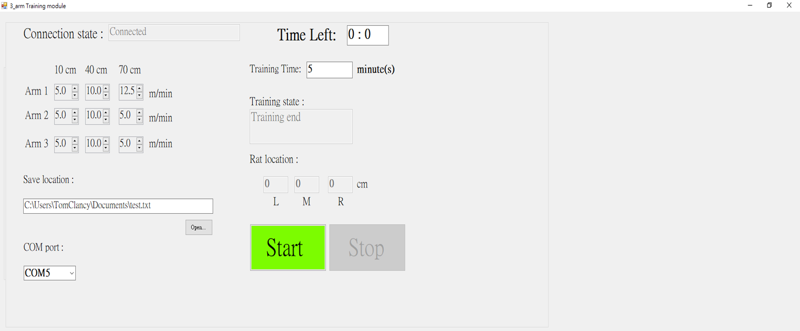

# A 3-arm-Escalator training platform for lab rat
## Introduction
This platform is is used to performing Rehabilitation of lab rat which suffered different level's Ischemic stroke.

## Rehabilitation Method
To rehabilitate the suffered lab rat, we set 3 trigger posints which at 10cm, 40cm and 70cm respectively inside each arm, then within the given training time, we are updating the speed of servo motors once the lab rats changes the position, ex: from 40cm to 10cm. The method described above is designed by medical researcher.

## Implementation
We use MCU's ADC peripheral to receive analog signal from IR sensor, which is the distance to the lab rat, then transfer the distance data to PC through wifi module, then PC replies a user-specified speed(12-bit DAC table) which correspond to the current lab rat location to the MCU, and then MCU apply the received DAC data to each arm's servo motor driver, this opration is performed once IR sensor detected the lab rat's location changed and the training time is not ended.

## Hardware Specification
- [EFM8LB12F64E](https://www.silabs.com/products/mcu/8-bit/efm8-laser-bee/device.efm8lb12f64e-qfn24) * 1
- Sharp 2Y0A21 IR distance sensor * 3
- Wifi module esp8266 * 1 (not used in this branch due to the setup time is too long(during PC connecting to the module) for now, hence we use wired communication(UART) temporarily)

## Screenshot & Picture
### UI

### Hardware

## Misc
This project use [Semantic Versioning](https://semver.org/).